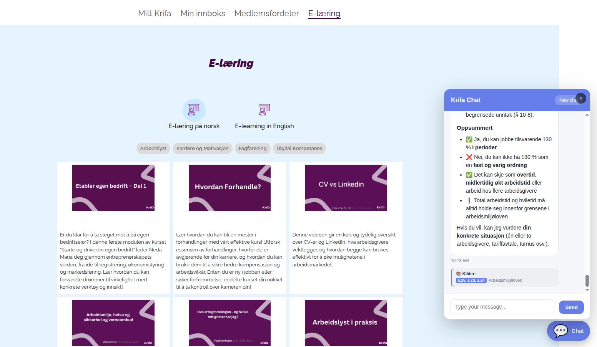

# Krifa RAG: Norwegian Legal Text Retrieval Chatbot
**March 2026** - Building a production-grade Retrieval-Augmented Generation system for Norwegian labor law, deployed as an embeddable widget for Krifa members

## Overview

**Krifa** is one of Norway's largest unions, supporting its members with workplace rights, employment contracts, and labor law guidance. This project delivered a production RAG-powered chatbot that allows Krifa members to ask natural language questions about Norwegian labor law and receive accurate, sourced answers — all within an embeddable chat widget integrated directly into their e-learning platform.

The core dataset was the **Norwegian Working Environment Act (Arbeidsmiljøloven)**, provided and curated by a dedicated team of Krifa lawyers.

## The Challenge

Legal text retrieval is fundamentally different from general-purpose search. Norwegian labor law is dense, interconnected, and full of exceptions — making naive RAG approaches fail in subtle but critical ways.

The key difficulties included:

- **Highly conditional clauses**: A single law section often contains multiple exceptions and cross-references to other paragraphs (e.g., §10-8 referencing §5-25, §23, §24)
- **Domain-specific language**: Norwegian legal terminology requires precise understanding — a small semantic drift in retrieval can return a plausible but legally wrong answer
- **Clause interdependencies**: Questions rarely map to a single chunk; correct answers often require combining information from several related sections
- **Validation bar**: The ground truth was set by practicing lawyers — the margin for error was essentially zero

## Solution: RAG with FAISS and Smarter Data Preparation

Rather than applying a standard out-of-the-box RAG pipeline, we invested heavily in the data preparation and retrieval layers to handle the complexity of legal text.

### ⚙️ Tech Overview

- **Retrieval**: FAISS (Facebook AI Similarity Search) — selected after benchmarking against Azure AI Search and Chroma for cost efficiency and retrieval quality at scale
- **Chunking Strategy**: Custom legal-aware chunking that respects paragraph and clause boundaries, keeping cross-referenced sections linked rather than splitting them arbitrarily
- **Embeddings**: Dense vector embeddings tuned for Norwegian legal language
- **LLM Layer**: Prompt-engineered to surface source citations (paragraph numbers) alongside every answer
- **Validation**: Gold dataset constructed by the Krifa lawyer team, used for end-to-end retrieval and response accuracy testing
- **Deployment**: Packaged as a lightweight JavaScript chat widget — clients embed it on any page with a single script tag

### The Retrieval Benchmarking Process

We evaluated three retrieval backends:

| Backend | Strengths | Why Not Deployed |
|---|---|---|
| Azure AI Search | Managed, scalable, hybrid search | Cost at scale; less control over chunking |
| Chroma | Simple setup, good for prototyping | Performance at production volume |
| **FAISS** | Fast, cost-efficient, fully controllable | **Selected for production** |

FAISS gave us full control over the index structure and allowed the optimizations needed to handle the legal corpus correctly without ongoing cloud retrieval costs.

## The Hard Part: Chunking Legal Text

The biggest technical breakthrough in this project was moving away from fixed-size chunking. Early versions performed poorly because:

- Splitting mid-paragraph broke the logical context of a clause
- Exception phrases like *"med unntak av"* (with the exception of) would be separated from the rule they modified
- Cross-references to other sections were lost, leaving the retriever unable to connect related rules

The solution was a **structure-aware chunking pipeline** that:

1. Parsed the legal document by section and paragraph markers
2. Kept clause headers attached to their body text
3. Embedded cross-reference metadata so related sections could be retrieved together
4. Applied overlap between adjacent chunks to preserve boundary context

This dramatically improved recall on questions that spanned multiple sections.

## Validation: Lawyers as the Ground Truth

A gold dataset was constructed manually by the Krifa legal team — real questions members ask, paired with the correct legal answers and the exact source paragraphs. This was used to measure:

- **Retrieval accuracy**: Did the right paragraph(s) get returned?
- **Answer faithfulness**: Was the generated answer grounded in the retrieved text?
- **End-to-end correctness**: Did the final response match what a lawyer would say?

The lawyers reviewed the outputs and were both satisfied and surprised by the accuracy. Getting there required multiple rounds of iteration — adjusting chunk boundaries, tuning retrieval parameters, and refining prompts — but the gold dataset gave us an objective signal at every step.

## The Widget

The final product was packaged as an embeddable **"Krifa Chat"** widget. Key design decisions:

- **Source transparency**: Every answer surfaces the specific paragraph numbers (e.g., *§5-25, §23, §24 — Arbeidsmiljøloven*) so members and lawyers can verify the reference
- **Zero friction embedding**: A single script tag drops the widget into any page
- **Stateless sessions**: Each conversation is independent, keeping data simple and compliant
- **Bilingual support**: The platform supports both Norwegian and English member interactions

## What I Learned

This project pushed the limits of what RAG can do with structured legal corpora:

- **Chunking is the most critical layer**: Retrieval quality is largely determined before the LLM ever sees the text — poor chunking cannot be compensated for downstream
- **Domain experts are essential**: The gold dataset from lawyers was invaluable; without it, we would have been optimizing in the dark
- **Benchmarking backends early pays off**: Testing Azure AI Search, Chroma, and FAISS upfront saved us from a costly late-stage migration
- **Legal text demands structured parsing**: Generic document loaders are not sufficient for law — the document structure carries meaning that must be preserved

## Results

- Lawyers validated the system and approved it for member use
- Retrieval accuracy on the gold dataset met the quality bar set by the legal team
- Deployed as a production widget on Krifa's e-learning platform
- Members can now get instant, sourced answers to Norwegian labor law questions 24/7

---

*This project demonstrates that RAG systems for legal domains require domain-aware engineering at every layer — from document parsing and chunking to retrieval tuning and expert-driven validation. The combination of FAISS, structure-aware chunking, and a lawyer-constructed gold dataset made it possible to deliver a system that legal professionals trust.*
